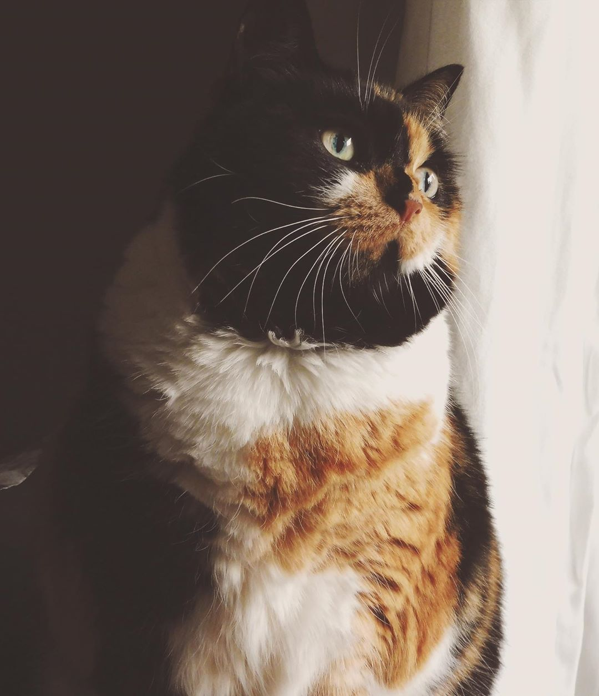
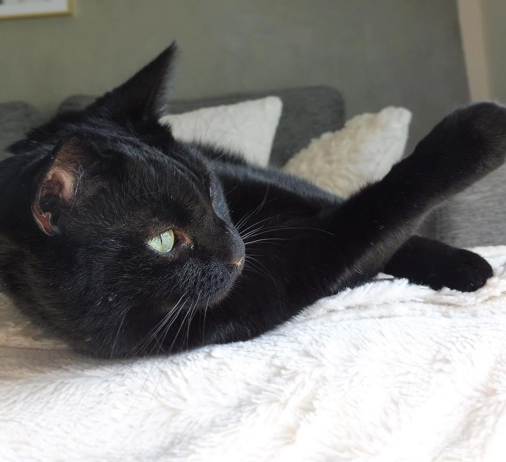
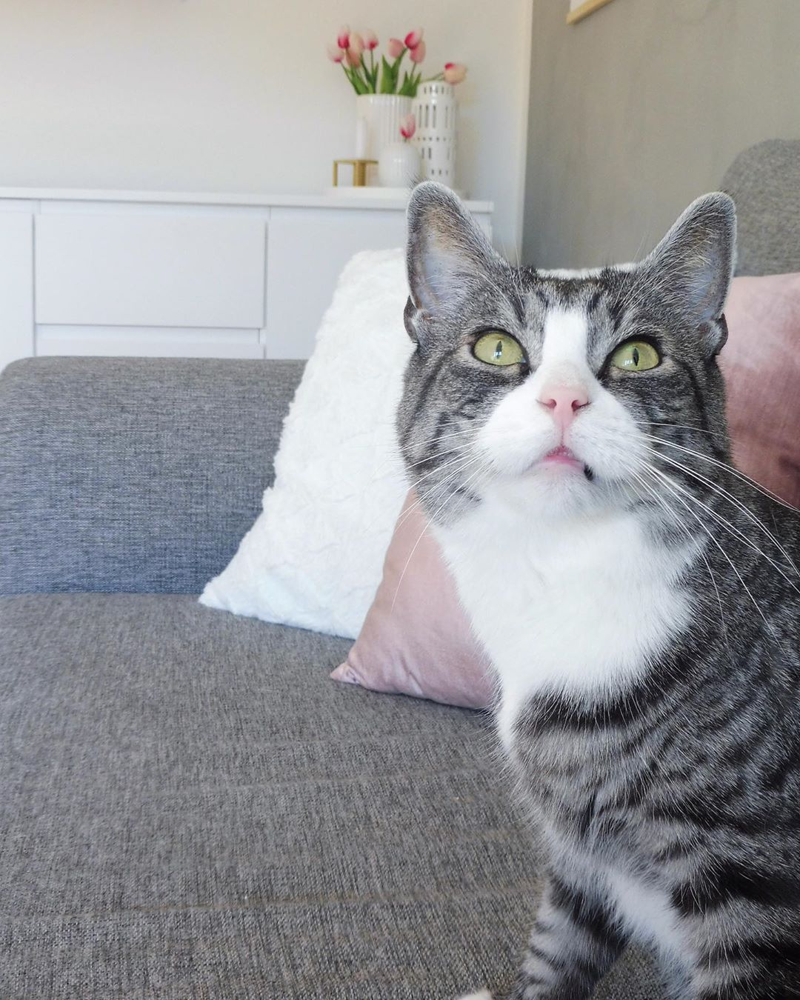

# 
Hi there 👋

## Short Version

- 💻 Backend developer
- 📖 Reader
- 🏃‍♂️ Runner
- ♟ Boardgamer
- 🐱 Father of 3 cats

## About Me

### 📖 Reading

I like reading. Go see my [reading challenge](https://www.goodreads.com/user_challenges/19182382).

### 🏃‍♂️ Running

I love running 🏃‍♂️ I might not be the fastest man alive, but that doesn't stop me.

#### Running Achievements

|Distance|Time|
|--------|----|
|5 km|30:05|
|10 km|1:02:32|
|17.01 km|2:01:01|

### ♟ Boardgames

I love playing boardgames! Do you wanna see my [collection?](https://geekgroup.app/users/anbora/collection)

### 🐱 Father of 3 Cats

Baby

Bette Mand

Miv

<!-- 

 -->

<!--
**Anras573/Anras573** is a ✨ _special_ ✨ repository because its `README.md` (this file) appears on your GitHub profile.

Here are some ideas to get you started:

- 🔭 I’m currently working on ...
- 🌱 I’m currently learning ...
- 👯 I’m looking to collaborate on ...
- 🤔 I’m looking for help with ...
- 💬 Ask me about ...
- 📫 How to reach me: ...
- 😄 Pronouns: ...
- ⚡ Fun fact: ...
-->
